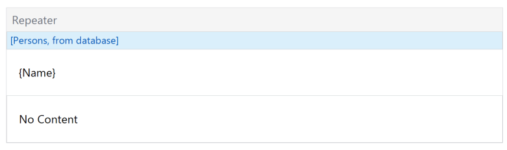
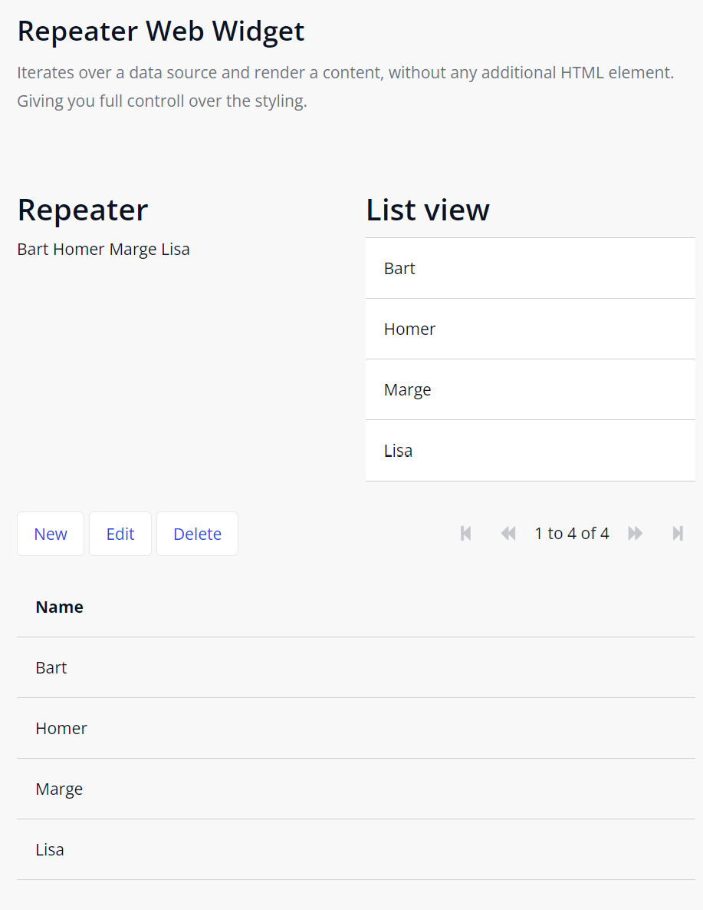
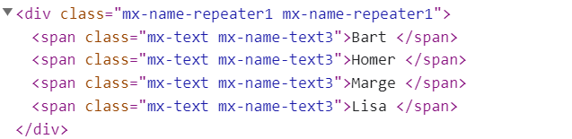

# Repeater

Iterates over a data source and renders content without any additional element.

## Features

-   Render a data source content without any additional elements.
-   The widget will give you complete control of the styling and the rendering.
-   Suitable for the web, similar function to the Mendix native repeater widget.
-   For small data sets.

Please note that there is no pagination. The developer is responsible for sensible data sets.

## Usage

1. Place the widget on a page
1. Select a data source
1. Model the content
1. Optional: provide the content when no items are in the data source

| structure mode                                                 | web                                    | html                                     |
| -------------------------------------------------------------- | -------------------------------------- | ---------------------------------------- |
|  |  |  |

## Demo project

https://testrepeaterweb-sandbox.mxapps.io/

## Issues, suggestions and feature requests

https://github.com/ClevrSolutions/repeater-web
